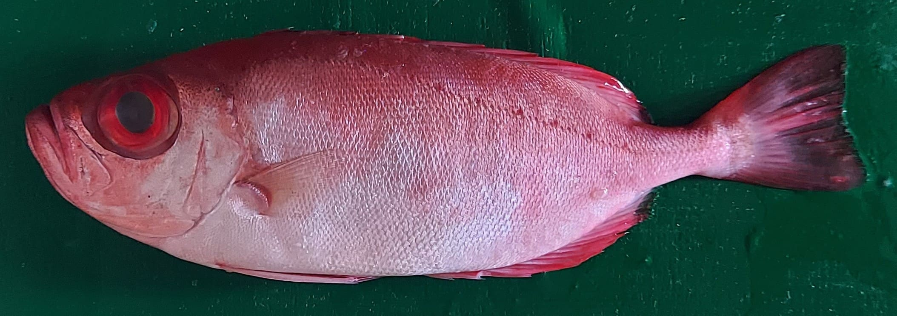

# pickfish-modelling

Deep Learning model for Fish Freshness Detection System (pickfish apps) using You Look Only Once Version 4 (YOLOv4) and
YOLOv4-Tiny

## Dataset

### Fish

appearance of each fish for the dataset

| Name                      | Appearance                                                                 |
|---------------------------|----------------------------------------------------------------------------|
| _Atule Mate_              |                             |
| _Caranx Melanophygus_     |           |
| _Euthynus Affnis_         |                   |
| _Nemipterus Virgatus_     |           |
| _Priacantus Tayesnus_     |            |
| _Rastrelliger Brachysoma_ |  |
| _Restrelliger Kanagurta_  |     |
| _Scomber Australasicus_   |      |

### Eyes and skins condition of fish

Appearance of sample condition eye and skin of fish for _Retrelliger Kanagurta_, _Auxis Rochei_, and Caranx Sexfaciatus.

| Condition / Fish Name      | _Restrelliger Kanagurta_                    | _Auxis Rochei_                              | _Caranx Sexfaciatus_                        |
|----------------------------|---------------------------------------------|---------------------------------------------|---------------------------------------------|
| Fresh Eyes - Fresh Skins   |  |  |  |
| Fresh Eyes - Medium Skins  | **No Sample**                               |  | **No Sample**                               |
| Fresh Eyes - Spoil Skins   | **No Sample**                               | **No Sample**                               | **No Sample**                               |
| Medium Eyes - Fresh Skins  |  |  |  |
| Medium Eyes - Medium Skins |  |  |  |
| Medium Eyes - Spoil Skins  |  |  | **No Sample**                               |
| Spoil Eyes - Fresh Skins   | **No Sample**                               | **No Sample**                               |  |
| Spoil Eyes - Medium Skins  |  |  |  |
| Spoil Eyes - Spoil Skins   |  |  |  |

## Experimental Process
Setup of hyperparameter of YOLOv4 and YOLOv4-Tiny

| No. | Model       | Pretrained Model       | Dimension | Data Augmentation | With Empty Label | Iteration | Learning Rate | Momentum | Decays | Batch Size |
|-----|-------------|------------------------|-----------|-------------------|------------------|-----------|---------------|----------|--------|------------|
| 1.  | YOLOv4      | yolov4.conv.137        | 416x416   | Yes               | No               | 14000     | 0.0001        | 0.949    | 0.0005 | 64         |
| 2.  | YOLOv4      | yolov4.conv.137        | 832x832   | Yes               | Yes              | 14000     | 0.0001        | 0.949    | 0.0005 | 64         |
| 3.  | YOLOv4      | (trained from scratch) | 832x832   | Yes               | Yes              | 14000     | 0.0001        | 0.949    | 0.0005 | 64         |
| 4.  | YOLOv4      | yolov4.conv.137        | 416x416   | Yes               | Yes              | 14000     | 0.0001        | 0.949    | 0.0005 | 64         |
| 5.  | YOLOv4-Tiny | yolov4.tiny.conv.29    | 416x416   | Yes               | No               | 14000     | 0.00261       | 0.9      | 0.0005 | 64         |
| 6.  | YOLOv4-Tiny | yolov4.tiny.conv.29    | 416x416   | Yes               | Yes              | 14000     | 0.00261       | 0.9      | 0.0005 | 64         |

Charts during the training process. There is chart (a), (b) and (c) cause my sessions during training ended in google colab.

| Model No. | (a)                                     | (b)                                     | (c)                                     |
|-----------|-----------------------------------------|-----------------------------------------|-----------------------------------------|
| 1.        |     |                                         |                                         |
| 2.        | .png) | .png) |                                         |
| 3.        | .png) | .png) | .png) |
| 4.        | .png) | .png) |                                         |
| 5.        | .png) | .png) |                                         |
| 6.        |     |                                         |                                         |

Model Evaluation (in percentage (%)).

| Model No. | Precisions | Recall | F1 Score | mAP   | AP Fish | AP Fresh eye | AP Fresh Skin | AP Medium Eye | AP Medium Skin | AP Spoil Eye | AP Spoil Skin |
|-----------|------------|--------|----------|-------|---------|--------------|---------------|---------------|----------------|--------------|---------------|
| 1.        | 89         | 98     | 93       | 99.17 | 99.1    | 99           | 99.7          | 99.8          | 99.3           | 99.6         | 99.7          |
| 2.        | 85         | 94     | 90       | 96.87 | 99.5    | 97.6         | 97.5          | 94.4          | 93.9           | 97.8         | 97.4          |
| 3.        | 81         | 92     | 86       | 93.32 | 99.3    | 96.8         | 96.8          | 88.6          | 87.1           | 95           | 88.5          |
| 4.        | 83         | 95     | 88       | 95.79 | 99.7    | 97.2         | 97.2          | 91            | 92.7           | 97.5         | 95.1          |
| 5.        | 84         | 97     | 90       | 97.25 | 98.7    | 98.6         | 98.6          | 94.8          | 95.5           | 98.4         | 96.7          |
| 6.        | 84         | 94     | 89       | 93.63 | 99.7    | 97.3         | 97.3          | 90.3          | 89.1           | 96.7         | 88            |

Weight result from each model (Wait till my journal release)\
<a href="https://github.com/mlkabdazz/pickfish-modelling/tree/main/model/model_1">Model Number 1</a>\
<a href="https://github.com/mlkabdazz/pickfish-modelling/tree/main/model/model_2">Model Number 2</a>\
<a href="https://github.com/mlkabdazz/pickfish-modelling/tree/main/model/model_3">Model Number 3</a>\
<a href="https://github.com/mlkabdazz/pickfish-modelling/tree/main/model/model_4">Model Number 4</a>\
<a href="https://github.com/mlkabdazz/pickfish-modelling/tree/main/model/model_5">Model Number 5</a>\
<a href="https://github.com/mlkabdazz/pickfish-modelling/tree/main/model/model_6">Model Number 6</a>

### Selected model
From the six models has been trained, two models were selected to be implemented in mobile applications. YOLOv4 (Model No. 1) dan YOLOv4-Tiny (Model No. 5)
YOLOv4 Model : wait till my journal release. Sorry.
YOLOv4-Tiny Model : wait till my journal release. Sorry.

## My Publications (ON REVIEW)
Non-Destructive Fish Freshness Detection System for Mobile Application Using YOLOv4 and YOLOv4-Tiny

## References
- <a href="https://github.com/AlexeyAB/darknet">darknet</a>
- <a href="https://arxiv.org/abs/2004.10934">YOLOv4: Optimal Speed and Accuracy of Object Detection</a>
- <a href="https://github.com/hunglc007/tensorflow-yolov4-tflite">tensorflow-yolov4-tflite</a>
- Fish Name: <a href="http://nelpin.kkp.go.id/index.php/bantuan/apendix_ikan">Sistem Informasi Kenelayanan</a>