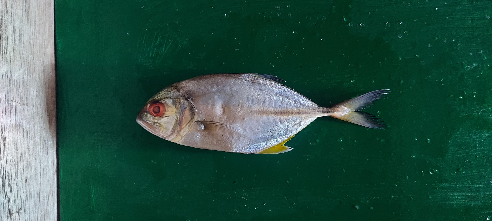

# pickfish-modelling
Deep Learning model for Fish Freshness Detection System (pickfish apps) using You Look Only Once Version 4 (YOLOv4) and YOLOv4-Tiny

## Dataset
### Fish
appearance of each fish for the dataset  
Name | Appearance\
--- | ---\
_Atule Mate_ | \
_Caranx Melanophygus_ | \
_Euthynus Affnis_ | \
_Nemipterus Virgatus_ | \
_Priacantus Tayesnus_ | \
_Rastrelliger Brachysoma_ | \
_Restrelliger Kanagurta_ | \
_Scomber Australasicus_ | \

### Eyes and skins condition of fish
Appearance of condition eye and skin of fish.
Condition / Fish Name | _Restrelliger kanagurta_ | _Auxis rochei_ | _Caranx sexfaciatus_\
--- | --- | --- | ---\
Fresh Eyes - Fresh Skins |  |  | \
Fresh Eyes - Medium Skins | **No Sample** |  | **No Sample**\
Fresh Eyes - Spoil Skins | **No Sample** | **No Sample** | **No Sample**\
Medium Eyes - Fresh Skins |  |  | \
Medium Eyes - Medium Skins |   |  | \
Medium Eyes - Spoil Skins |   |  | **No Sample**\
Spoil Eyes - Fresh Skins | **No Sample** | **No Sample** | \
Spoil Eyes - Medium Skins |  |  | \
Spoil Eyes - Spoil Skins |  |  | \

## Experimental Process
### Result of experimental

### Selected model